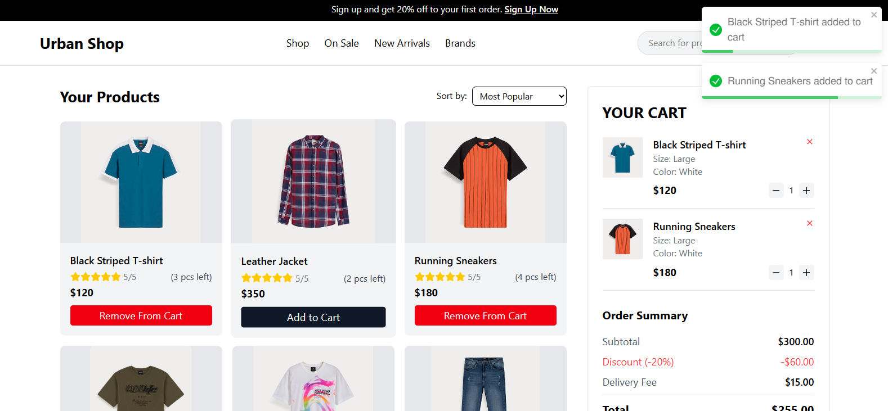

# 🛒 React Shopping Cart with Stock Management

A dynamic e-commerce cart assignment built using **React**, **Context API**, and **Tailwind CSS**, where users can browse products, manage cart items, update quantities, sort and search products, and handle stock availability in real-time.

---

## 🚀 Live Preview

- 🔗 **Live Site:** [urban-shop-xi.vercel.app](urban-shop-xi.vercel.app)
- 💻 **GitHub Repo:** [https://github.com/taibislamdipu/urban-shop](https://github.com/taibislamdipu/urban-shop)

---

## 📸 Screenshot



---

## 📋 Assignment Requirements

- ✅ Initialize the project using **Vite** with **React JavaScript** (no TypeScript)
- ✅ Use the given `dist` HTML Template as the base
- ✅ Create a dummy array of product objects with name, price, stock, image, discount, rating, etc.
- ✅ Dynamically render product cards using the dummy data
- ✅ Product card must include title, price, stock, image, and action buttons
- ✅ Add to Cart functionality updates the cart
- ✅ Toggle between "Add to Cart" and "Remove from Cart" based on item state
- ✅ Prevent adding to cart when stock is 0 (button should be disabled)
- ✅ Stock must update accordingly when items are added or removed
- ✅ Quantity controls inside the cart:
  - `+` button increases quantity (up to stock limit)
  - `-` button decreases quantity (min 1)
- ✅ Deleting a product from the cart restores its stock in the product list
- ✅ Order Summary:
  - Subtotal = price × quantity
  - Fixed 20% discount
  - Fixed delivery fee
  - Total = subtotal - discount + delivery fee
- ✅ Sorting Options:
  - Most Popular
  - Newest
  - Price (Low to High, High to Low)
- ✅ Search functionality filters products by title
- ✅ If no results found, display "No products found."
- ✅ Use **Context API** and **useReducer** for state management

---

## 🧠 What I Learned

- Creating and managing global state using React **Context API**
- Implementing **cart logic**, including quantity, subtotal, and stock handling
- Dynamic UI rendering based on state changes
- Sorting and filtering lists using `useMemo`
- Component design and stateful interactions
- Tailwind CSS layout and responsive design
- Working with conditional rendering and user experience (UX) flow

---

## 🔧 Tech Stack

- React + Vite
- Tailwind CSS
- Context API
- JavaScript (no TypeScript)
- Icons from `react-icons`

---

## 👨‍💻 Developer

Built with 💙 by [**Taib Islam Dipu**](https://github.com/taibislamdipu)

---

## 📁 Project Setup

```bash
# Install dependencies
npm install

# Run development server
npm run dev

# Build for production
npm run build
```
